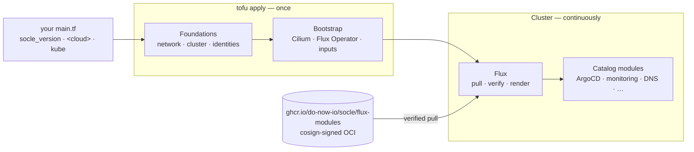

<div align="center">

# Socle

**An open source GitOps distribution for managed Kubernetes clusters:
EKS, GKE, AKS and Scaleway Kapsule.**

Pick your cloud, pick your modules. You get one signed OCI artifact that Flux
pulls, and upgrading the whole platform is a one-line change in Git.

[](https://scorecard.dev/viewer/?uri=github.com/do-now-io/socle)
[](https://github.com/do-now-io/socle/actions/workflows/pr-static.yaml)
[](LICENSE)

[](docs/assets/socle-demo.mp4)

<sub>Click the animation to watch the full-quality video with sound.</sub>

</div>

**Documentation: <https://do-now-io.github.io/socle/>**

> [!WARNING]
> **Pre-0.1.0. Socle is still being built, and nothing has been released.**
> Every push to `main` publishes a signed alpha. See [Status](#status).

## Why Socle

- **One apply.** A single OpenTofu root creates the cluster, installs Flux on
  it and hands the catalog over. After that, OpenTofu steps away.
- **One version.** `socle_version` pins the OpenTofu modules and the Flux
  artifact together. An upgrade is one line in your tfvars.
- **Signed end to end.** Both artifacts are signed keyless with cosign. Flux
  checks the signature on every reconciliation, and you cannot turn that check
  off.
- **Mistakes fail at plan.** If you misspell a module name or an attribute,
  `tofu plan` rejects it and lists the allowed values. The value is not
  silently dropped.
- **No out-of-band scripts.** When a module needs cloud access, the module
  declares its own IAM through Crossplane. Adding a module never changes the
  cloud foundations.
- **Your values win.** Every module accepts any chart value in `values`.
  Secrets go in `values_secret`, so they never reach the OpenTofu state.

## How it works



| Layer | What it is | Owned by |
| --- | --- | --- |
| **Foundations** | One OpenTofu module per cloud: network, managed cluster, node group, identities | OpenTofu, applied once |
| **Bootstrap** | Cilium and CoreDNS where the cloud doesn't provide them, then the Flux Operator and your validated inputs | OpenTofu, in the same apply |
| **Catalog** | À la carte modules, one Flux Operator `ResourceSet` each, rendered from your inputs | Flux, from the signed artifact |

How the parts fit, and why: [Architecture](https://do-now-io.github.io/socle/architecture/overview/).

## What you write

You write one `main.tf` per cluster, calling the socle's root for your cloud.
Under `kube`, list only the values that differ from the catalog defaults:

```hcl
# clusters/prod/main.tf (plus your state backend)
locals {
  socle_version = "0.1.0" # the only line an upgrade touches. x-release-please-version
}

module "socle" {
  source = "oci://ghcr.io/do-now-io/socle/opentofu-modules//opentofu/clusters/aws?tag=${local.socle_version}"

  socle_version = local.socle_version

  aws = {
    region             = "eu-west-3"
    cluster_name       = "acme-prod"
    owner              = "platform"
    environment        = "prod"
    kubernetes_version = "1.34"
    availability_zones = ["eu-west-3a", "eu-west-3b", "eu-west-3c"]
    cluster_endpoint_public_access_cidrs = ["203.0.113.0/24"]
    gateway_certificate = { domain = "acme.example" }
  }

  kube = {
    argocd          = { domain = "argocd.acme.example" }
    victoria_traces = { enabled = true }
  }
}
```

```sh
tofu init && tofu apply
kubectl -n flux-system get resourceset    # socle-root and one per module
```

The full walkthrough is the [AWS quickstart](docs/getting-started/aws.md),
and every option is documented in
[prod.tfvars.example](opentofu/clusters/aws/prod.tfvars.example).

## The catalog

Each module is a Flux Operator `ResourceSet` you turn on or off under `kube`.
The version is the upstream application's, pinned in the module.

### Continuous delivery

| Module | What it does | Version | Default | Clouds | Notes |
| --- | --- | --- | :---: | --- | --- |
| [`argocd`](docs/catalog/argocd.md) | GitOps for your applications. Flux runs the socle, and ArgoCD runs your apps | 3.5.3 | on | All | |

### Monitoring

The stack's design: [Observability](docs/architecture/observability.md).

| Module | What it does | Version | Default | Clouds | Notes |
| --- | --- | --- | :---: | --- | --- |
| [`victoria_metrics`](docs/catalog/victoria-metrics.md) | Metrics storage | 1.153.0 | on | All | |
| [`victoria_logs`](docs/catalog/victoria-logs.md) | Logs storage | 1.52.0 | on | All | |
| [`victoria_traces`](docs/catalog/victoria-traces.md) | Traces storage | 0.11.0 | off | All | Pre-GA upstream |
| [`otel_agent`](docs/catalog/otel-agent.md) | Node-level OpenTelemetry collector: kubelet metrics and container logs | 0.160.0 | on | All | |
| [`otel_gateway`](docs/catalog/otel-gateway.md) | Cluster-level collector: object state, Prometheus scraping, OTLP | 0.160.0 | on | All | |
| [`grafana`](docs/catalog/grafana.md) | One place to read every signal, with each module's dashboards loaded | 13.2.2 | on | All | |
| [`alerting`](docs/catalog/alerting.md) | vmalert evaluates the socle's rules, and Alertmanager routes what fires to your receivers | 1.153.0 · 0.34.1 | off | All | Needs `victoria_metrics` |
| [`metrics_server`](docs/catalog/metrics-server.md) | The resource metrics API behind `kubectl top` and CPU or memory autoscaling | 0.9.0 | on | AWS | GKE, AKS and Kapsule ship their own |

### Security

| Module | What it does | Version | Default | Clouds | Notes |
| --- | --- | --- | :---: | --- | --- |
| [`kyverno`](docs/catalog/kyverno.md) | The Kyverno admission engine, with no policy | 1.19.1 | off | All | Its webhooks never see the socle's namespaces |
| [`kyverno_policies`](docs/catalog/kyverno-policies.md) | Pod Security Standards, requests required, no `latest` tag, a registry allow-list, all in Audit; `enforce` makes a policy a native refusal | 1.19.1 | off | All | Needs `kyverno`; judges your applications, never the socle |
| [`external_secrets`](docs/catalog/external-secrets.md) | Kubernetes Secrets read from the cloud's secret manager, kept in step when they rotate | 2.11.0 | off | All | On AWS with `crossplane`: its own read-only role on a name prefix, and the `secret-manager` store |
| [`reloader`](docs/catalog/reloader.md) | Rolls a workload when a ConfigMap or Secret it reads changes | 1.4.22 | off | All | Opt-in per workload, by annotation |

### Networking and exposure

| Module | What it does | Version | Default | Clouds | Notes |
| --- | --- | --- | :---: | --- | --- |
| [`gateway_api`](docs/catalog/gateway-api.md) | Gateway API CRDs and the shared `public` and `private` Gateways | 1.6.1 | on | AWS · Azure · Scaleway | Built into GKE on GCP |
| [`external_dns`](docs/catalog/external-dns.md) | Publishes routes into the cloud's DNS zone | 0.22.0 | off | All | Turned on for you on AWS once a certificate is set |

### Cloud resources

| Module | What it does | Version | Default | Clouds | Notes |
| --- | --- | --- | :---: | --- | --- |
| [`crossplane`](docs/catalog/crossplane.md) | Lets each module declare its own cloud IAM | 2.4.2 | off | All | Needed by `external_dns` and `velero`, and by `keda` and `external_secrets` for their cloud access |

### Autoscaling

| Module | What it does | Version | Default | Clouds | Notes |
| --- | --- | --- | :---: | --- | --- |
| [`keda`](docs/catalog/keda.md) | Event-driven autoscaling, down to zero | 2.21.0 | off | All | |

### Backup

| Module | What it does | Version | Default | Clouds | Notes |
| --- | --- | --- | :---: | --- | --- |
| [`velero`](docs/catalog/velero.md) | Backup and restore of the applications' volumes and their objects, into the module's own bucket | 1.18.2 | off | AWS | Needs `crossplane` |

Cilium and CoreDNS come before the catalog. On AWS and Azure the bootstrap
module installs them ahead of Flux. GKE and Kapsule run their own:
[Cilium before Flux](docs/architecture/cilium-before-flux.md).

## Clouds

| Cloud | Foundations | One-apply root | Docs |
| --- | :---: | :---: | --- |
| AWS · EKS | ✅ | ✅ [`clusters/aws`](opentofu/clusters/aws) | [AWS](docs/clouds/aws/index.md) |
| GCP · GKE | ✅ | ⏳ | [GCP](docs/clouds/gcp/index.md) |
| Azure · AKS | ✅ | ⏳ | [Azure](docs/clouds/azure/index.md) |
| Scaleway · Kapsule | ✅ | ⏳ | [Scaleway](docs/clouds/scaleway/index.md) |

## Status

Socle is **pre-0.1.0**, and no version has been released yet.

- The foundations modules exist for all four clouds. The single-apply root
  exists for AWS only, so far.
- Every catalog module ships its own [Chainsaw](https://kyverno.github.io/chainsaw/)
  suite. CI runs these suites on floci,
  an AWS emulator with k3s, with one job per module and cloud. Each job applies
  OpenTofu, turns the module on and off, and ends with `tofu destroy`.
- Every push to `main` publishes `<next>-alpha.N`, signed. To release, you
  merge the release-please PR, which re-tags that same alpha. Nothing is
  rebuilt.
- Both packages are public: the cluster pulls the Flux artifact,
  `ghcr.io/do-now-io/socle/flux-modules`, and `tofu init` the OpenTofu
  modules, `ghcr.io/do-now-io/socle/opentofu-modules`, with no credential.

## Security

See [SECURITY.md](SECURITY.md). Report vulnerabilities through
[private vulnerability reporting](https://github.com/do-now-io/socle/security/advisories/new),
never in public issues.

## License

[Apache-2.0](LICENSE)
