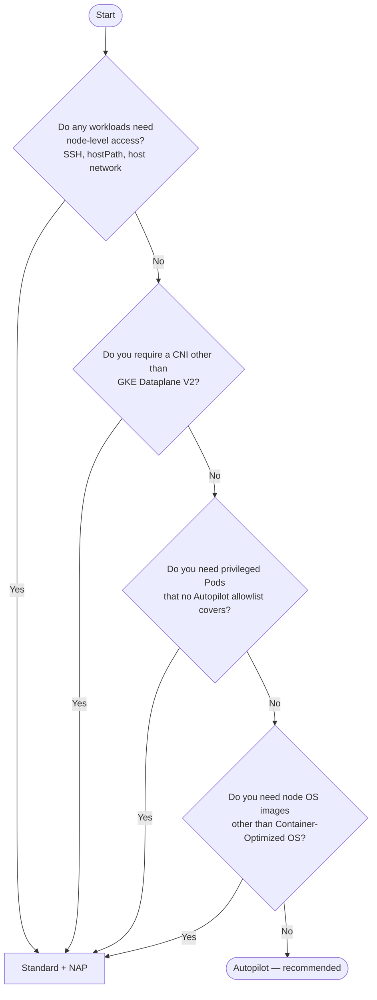

# Socle on Google Cloud (GKE)

How to prepare a Google Cloud project for Socle and install the GKE
foundations module.

> **Status: pre-0.1.0.** The `opentofu/gcp` root module is still a
> placeholder, so the commands in [Part 2](#part-2--installation) are not
> runnable yet. Part 1 is stable and worth reading now: the decisions it
> asks you to make are create-time and expensive to reverse. Variable
> names in Part 2 describe the module's intended interface and may change
> before 0.1.0.

---

## Part 1 — Prerequisites

### The one decision that constrains everything else

GKE runs a cluster in one of two modes, and **the mode cannot be changed
after the cluster is created**. Switching later means creating a second
cluster and migrating workloads to it. Everything else in this guide is
adjustable; this is not.

- **Autopilot** — Google provisions and operates the nodes. You submit
  Pods; you do not manage node pools, node OS, or node upgrades. Billing
  follows the resources your Pods request.
- **Standard + NAP** — you own the node layer. [Node
  auto-provisioning][nap] (NAP) automates most of the node pool
  lifecycle, but the configuration, limits, hardening and monitoring of
  that layer stay yours. Billing follows the nodes, running or idle.

**Socle recommends Autopilot** and ships it as the module default. Pick
Standard + NAP only if you land on it through the questions below.

### Decision tree



Four "no" answers is the common case. Each "yes" is a real constraint, not
a preference — verify it against a current requirement before it sends you
down the Standard path, because the node layer it hands you is permanent
operational work.

### Questions and answers

**Q1. What actually stops us from using Autopilot?**

Autopilot constrains the cluster in exchange for operating it. The
restrictions that end up mattering in practice:

| Restriction | What it blocks |
| --- | --- |
| No node access | SSH to nodes, node-level agents, custom kernel modules |
| GKE Dataplane V2 enforced | Calico, Flannel, self-managed Cilium, custom eBPF programs |
| Network policy always enforced | Running with policy enforcement disabled |
| Privileged Pods restricted | Privileged containers, host namespaces, writable `hostPath` |
| Container-Optimized OS only | Ubuntu or Windows Server node pools |
| Mandatory auto-upgrade | Pinning a cluster version indefinitely (timing is still yours — see Q3) |

Several observability and security vendors ship Autopilot-compatible
deployments through Google's [partner allowlists][partners], so "our
agent needs privileges" is worth checking against that list before it
becomes a blocker. Socle's own components — Flux, Crossplane, the catalog
modules — require no privileged access and run on Autopilot as-is.

**Q2. Regional or zonal control plane?**

Regional. It replicates the control plane across zones in the region and
survives a zone outage; a zonal cluster does not. Zonal is defensible for
a throwaway sandbox and nothing else. This is a create-time choice too.

**Q3. Which release channel?**

Every Socle cluster is enrolled in a release channel, which means
upgrades arrive automatically. You control *when*, not *whether*:

- **Regular** — the default, and the right answer for production.
- **Rapid** — new minor versions early; use it for a canary cluster, not
  for production.
- **Stable** — the slowest promotion. Choose it only if you have a
  written change-freeze obligation.

Set a [maintenance window][maintenance] that matches your low-traffic
hours, and maintenance exclusions around known freeze periods. Plan to
stay on a supported version: letting a cluster fall out of standard
support is both a security exposure and, eventually, a billing event.

**Q4. Public or private control plane?**

Private is the default Socle assumes. It requires you to decide how your
CI runners and operators reach the API server — authorized networks, a
bastion, Cloud VPN/Interconnect, or Connect Gateway. Decide this before
the apply, because a private cluster you cannot reach from CI blocks the
Flux bootstrap.

**Q5. Who owns the IP plan?**

The module can create its own VPC, or attach to one you already run. If
you bring your own, you must supply a subnet plus two secondary ranges —
one for Pods, one for Services — and they must be large enough for the
cluster's eventual scale. Pod range sizing is effectively permanent, so
size it for growth rather than for today's node count. Confirm the ranges
do not overlap anything reachable over VPN or peering.

**Q6. Where does OpenTofu state live?**

In a GCS bucket **in your own project**, with object versioning enabled.
Socle does not host state for you. Create the bucket before the first
apply; it is the one resource that cannot be managed by the module that
depends on it.

**Q7. Which identity runs the apply?**

A dedicated service account (or a Workload Identity Federation binding
for your CI, which is preferable to a downloaded key). It needs, at
project scope:

- `roles/container.admin`
- `roles/compute.networkAdmin`
- `roles/iam.serviceAccountAdmin`
- `roles/iam.serviceAccountUser`
- `roles/resourcemanager.projectIamAdmin`
- `roles/storage.admin` on the state bucket only

Grant them for the apply and treat them as privileged. If your
organization requires narrower roles, start here and tighten after a
successful apply — the plan output tells you what is genuinely used.

### Checklist — every installation

- [ ] A Google Cloud project with billing enabled
- [ ] Required APIs enabled (Part 2, step 1)
- [ ] GCS bucket for OpenTofu state, object versioning on
- [ ] Provisioning identity with the roles from Q7
- [ ] Cluster mode decided (Q1) — create-time, irreversible
- [ ] Region chosen, regional control plane (Q2)
- [ ] Release channel and maintenance window decided (Q3)
- [ ] Control plane access path decided (Q4)
- [ ] IP plan confirmed, no overlap with peered networks (Q5)
- [ ] Quota headroom checked for the region: in-use IP addresses, CPUs,
      SSD, and any accelerator you intend to schedule
- [ ] `tofu` >= 1.8 and `kubectl` available to whoever or whatever runs
      the apply

### Additional checklist — Standard + NAP only

Everything below is work that Autopilot would have absorbed. It is the
real cost of the Standard path, and it does not end at install time.

- [ ] **NAP resource limits set.** Node auto-provisioning refuses to
      provision without cluster-wide maximums for CPU, memory and each
      accelerator type. These caps are your only guardrail against a
      runaway scale-up.
- [ ] **Node shape defined** — machine series, boot disk type and size,
      Spot vs on-demand, and which of these NAP is allowed to choose.
- [ ] **CNI chosen explicitly.** Dataplane V2 is recommended: it keeps
      network behaviour aligned with Autopilot clusters and with Socle's
      other supported clouds. Choosing otherwise is a divergence you own.
- [ ] **Network policy enforcement enabled.** It is not on by default in
      Standard.
- [ ] **Workload Identity enabled.** Not a default in Standard, and
      Socle's Crossplane providers and catalog modules assume it.
- [ ] **Node hardening enabled** — Shielded GKE nodes, secure boot,
      integrity monitoring.
- [ ] **Auto-repair and auto-upgrade enabled on every pool**, including
      pools NAP creates later.
- [ ] **Node OS and patch responsibility recorded.** Container-Optimized
      OS is the recommended image; whoever owns the cluster owns its
      patch cadence.
- [ ] **Pod density sized.** Max Pods per node interacts with the Pod
      secondary range from Q5 — get these consistent or you will run out
      of Pod IPs before you run out of CPU.
- [ ] **Node-level monitoring and alerting in place** — node pressure
      conditions, disk exhaustion, unschedulable Pods, NAP scale-up
      failures. Nothing else will tell you the node layer is unhealthy.
- [ ] **Quota headroom for every machine family NAP may pick**, not just
      the one you expect it to use.
- [ ] **DaemonSet contract reviewed.** Any node taints or labels you
      introduce must be tolerated by the DaemonSets Socle's catalog
      installs.

If this list looks like a standing operational commitment, that is
because it is one. That is the trade-off the decision tree is trying to
make visible.

---

## Part 2 — Installation

> Not runnable yet — see the status note at the top of this page.

### 1. Enable the required APIs

```bash
gcloud config set project YOUR_PROJECT_ID

gcloud services enable \
  container.googleapis.com \
  compute.googleapis.com \
  iam.googleapis.com \
  iamcredentials.googleapis.com \
  cloudresourcemanager.googleapis.com \
  serviceusage.googleapis.com
```

### 2. Create the state bucket

```bash
gcloud storage buckets create gs://YOUR_STATE_BUCKET \
  --location=YOUR_REGION \
  --uniform-bucket-level-access

gcloud storage buckets update gs://YOUR_STATE_BUCKET --versioning
```

### 3. Configure the module

Create a working directory that consumes `opentofu/gcp` and pins a
released version. Autopilot is the default, so a minimal Autopilot
configuration sets very little:

```hcl
terraform {
  backend "gcs" {
    bucket = "YOUR_STATE_BUCKET"
    prefix = "socle/gcp/prod"
  }
}

module "socle" {
  source = "github.com/do-now-io/socle//opentofu/gcp?ref=vX.Y.Z"

  project_id   = "YOUR_PROJECT_ID"
  region       = "YOUR_REGION"
  cluster_name = "prod"

  # cluster_mode defaults to "autopilot"

  release_channel    = "REGULAR"
  maintenance_window = "2026-01-01T02:00:00Z/PT4H"
}
```

Standard + NAP is opt-in, and the extra surface is the point:

```hcl
module "socle" {
  source = "github.com/do-now-io/socle//opentofu/gcp?ref=vX.Y.Z"

  project_id   = "YOUR_PROJECT_ID"
  region       = "YOUR_REGION"
  cluster_name = "prod"

  cluster_mode = "standard"

  node_auto_provisioning = {
    enabled        = true
    max_cpu        = 128
    max_memory_gb  = 512
    machine_series = ["E2", "N2"]
    disk_type      = "pd-balanced"
    disk_size_gb   = 100
  }

  release_channel    = "REGULAR"
  maintenance_window = "2026-01-01T02:00:00Z/PT4H"
}
```

Work through the Standard + NAP checklist above before you apply this
variant.

### 4. Apply

```bash
tofu init
tofu plan -out=tf.plan
tofu apply tf.plan
```

Review the plan. On a fresh project the module creates the network, the
cluster, the identities Socle needs, and the Flux bootstrap.

### 5. Verify the bootstrap

```bash
gcloud container clusters get-credentials prod --region YOUR_REGION

kubectl get pods -n flux-system
kubectl get kustomizations -A
```

Flux then pulls the signed Socle OCI artifact and reconciles the catalog
in dependency order. Reconciliation is the source of truth for what is
installed — a green `kustomization` is the signal to look for, not a
successful `tofu apply`.

### 6. Upgrade

Bump the artifact tag your cluster pins, in Git. Flux verifies the
signature and reconciles the change. The foundations module is versioned
separately: bump its `ref`, re-plan, and read the diff before applying —
node and network changes can be disruptive in ways a catalog bump is not.

---

## Reference

- [GKE modes of operation][modes]
- [Autopilot and Standard feature comparison][comparison]
- [Node auto-provisioning][nap]
- [GKE Dataplane V2][dpv2]
- [Autopilot partner workloads][partners]
- [Release channels][channels]
- [Maintenance windows and exclusions][maintenance]

GKE changes quickly, and the constraints above are the ones that were
accurate when this page was written. Confirm anything load-bearing
against the current documentation before you commit to it.

[modes]: https://cloud.google.com/kubernetes-engine/docs/concepts/choose-cluster-mode
[comparison]: https://cloud.google.com/kubernetes-engine/docs/resources/autopilot-standard-feature-comparison
[nap]: https://cloud.google.com/kubernetes-engine/docs/concepts/node-auto-provisioning
[dpv2]: https://cloud.google.com/kubernetes-engine/docs/concepts/dataplane-v2
[partners]: https://cloud.google.com/kubernetes-engine/docs/resources/autopilot-partners
[channels]: https://cloud.google.com/kubernetes-engine/docs/concepts/release-channels
[maintenance]: https://cloud.google.com/kubernetes-engine/docs/concepts/maintenance-windows-and-exclusions
